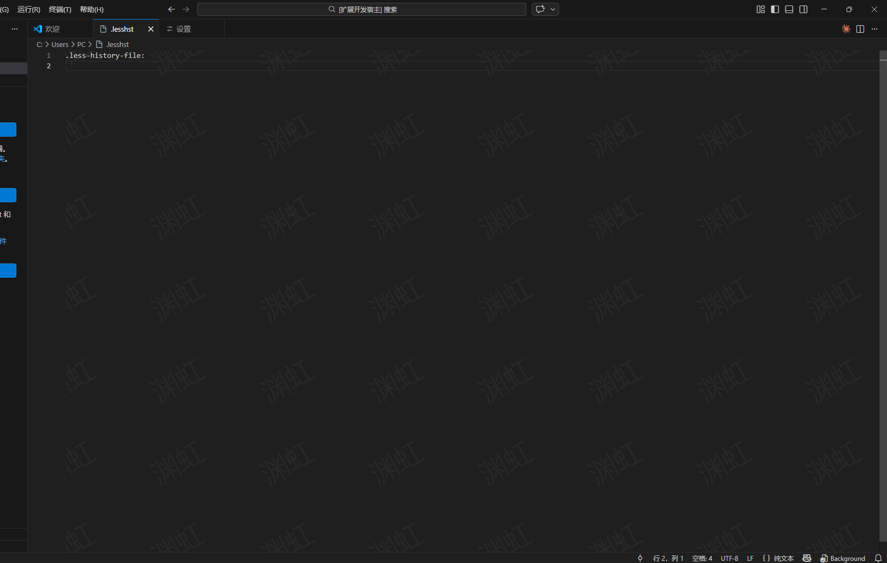

# EnvLens

通过文字水印快速区分 VSCode 窗口

## 功能介绍

当你同时开启多个 VSCode 窗口时，是否经常难以区分它们的用途？EnvLens 通过在编辑器背景添加半透明文字水印，让你一眼就能识别当前窗口。

### 特点

- 🎨 **随机名剑** - 未配置文字时，自动从历史名剑和秦时明月剑谱中随机选取
- ⚙️ **高度可配** - 支持自定义文字、透明度、大小、角度、颜色、间距等
- 🔄 **实时生效** - 修改配置后即时更新，无需重启
- 🎯 **一键切换** - 支持快速开启/关闭水印

## 配置项

在 VS Code 设置中搜索 `envlens` 进行配置：

| 配置项 | 类型 | 默认值 | 说明 |
|--------|------|--------|------|
| `envlens.enabled` | boolean | `true` | 是否启用水印 |
| `envlens.text` | string | `""` | 自定义水印文字，为空则随机选取名剑 |
| `envlens.opacity` | number | `0.08` | 水印透明度 (0-1) |
| `envlens.fontSize` | number | `50` | 文字大小 (10-100) |
| `envlens.angle` | number | `-30` | 文字倾斜角度 (-90~90) |
| `envlens.fontFamily` | string | `"Microsoft YaHei, SimHei, sans-serif"` | 字体族 |
| `envlens.spacingX` | number | `200` | 水印水平间距 (50-500) |
| `envlens.spacingY` | number | `150` | 水印垂直间距 (50-500) |
| `envlens.color` | string | `"#808080"` | 水印文字颜色 |

## 命令

按 `Ctrl+Shift+P` 打开命令面板，输入以下命令：

- **EnvLens: 刷新水印** - 手动刷新水印（重新随机选取文字）
- **EnvLens: 切换水印显示** - 快速开启或关闭水印

